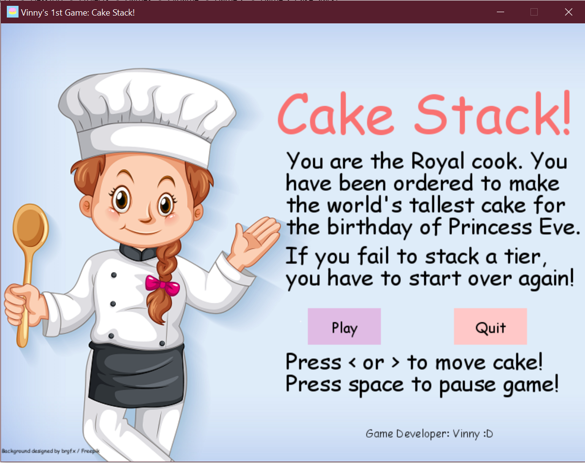
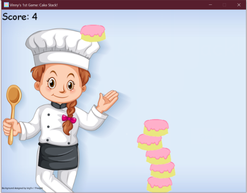
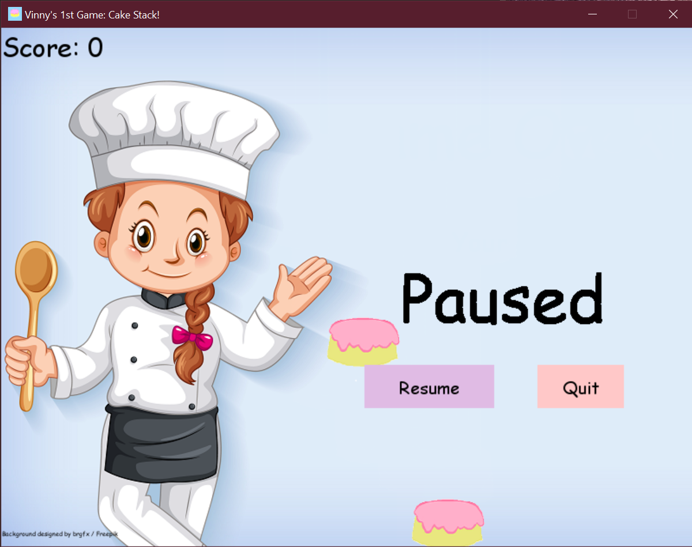
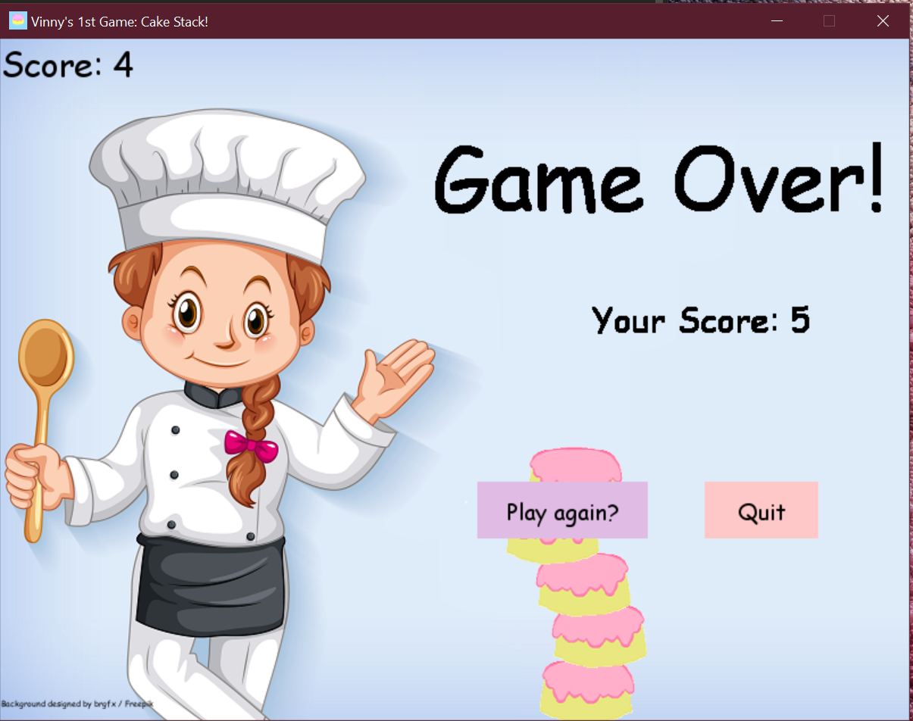

# Cake-Stack
It is a game created using the python module pygame. It is a simple game where you, the Royal cook, have to stack cakes that keep pouring down and make the biggest cake for the birthday of Princess Eve.

The game will start from the main menu explaining the story context and the instructions to play the game.

The play mode of the game looks as follows:

The game can be paused by clicking the space bar:

If the cake falls down with you failing to stack it, then the game will be over. The following shows the game over screen:

The backgroung image was chosen from a site called Freepik. The license details are already present in the image folder. The cake tiers were drawn by me.
Hope you have fun playing!
